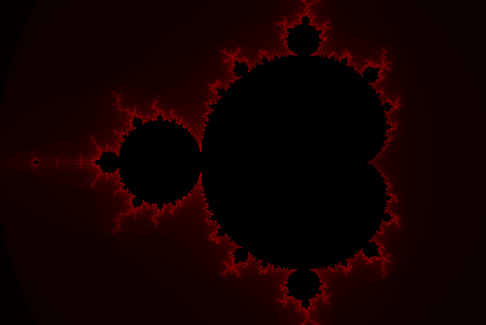

About
=====

My attempt at rendering the Mandelbrot set in high school.

The program supports point and click, adjustable number of iterations, adjustable zoom level, a button for taking screenshots ect.

It can colour a pixel based on the following methods:

- The number of iterations
- The distance from origo
- The cosine of the angle

